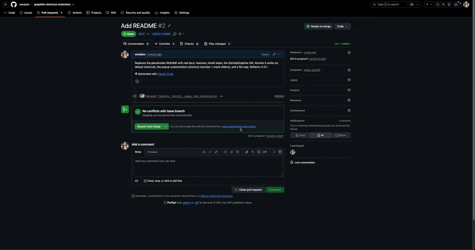

# 🐦 Graphite PR Shortcut

A tiny Chrome extension for hopping between **GitHub** and **Graphite** views of the same pull request — and copying both links — with customizable keyboard shortcuts. Copying rains **100 paper cranes** down the page, because why not.

## Features

- **Toggle GitHub ⇄ Graphite** — jump from a PR on one to the same PR on the other (opens in a new tab).
- **Copy both links** — puts a nicely formatted `PR #… / GitHub: … / Graphite: …` block on your clipboard.
- **Crane explosion** — every copy bursts 100 paper cranes (recolored to the Crane palette) outward from the center of the page.
- **Fully customizable popup** — rebind the shortcuts and tune every crane parameter. Settings sync via `chrome.storage.sync`.

## Install

1. `git clone` this repo.
2. Go to `chrome://extensions`.
3. Enable **Developer mode** (top right).
4. **Load unpacked** → select the repo folder.
5. Pin the 🐦 icon to your toolbar.

> After updating the code, reload the extension **and** reload any open PR tab — content scripts don't re-inject into already-open tabs.

## Usage

Works on:

- GitHub PRs — `github.com/<owner>/<repo>/pull/<number>`
- Graphite PRs — `app.graphite.com/github/pr/<owner>/<repo>/<number>`

| Default shortcut | Action |
|---|---|
| `Option/Alt + G` | Toggle this PR between GitHub and Graphite |
| `Ctrl + P` | Copy both links + crane explosion |

> On macOS the copy shortcut is `Ctrl + P` (not `Cmd + P`). Rebind it to `Cmd + P` in the popup if you prefer.

## Customizing

Click the toolbar icon to open the popup:

- **Shortcuts** — click a field, press the key combo you want (Esc cancels). Saved instantly.
- **Crane Explosion** — sliders for:
  - `count` (1–500)
  - `min` / `max` size (px)
  - `spread` (how far across the screen the burst reaches)
  - `gravity` (downward pull)
  - `spin` (max rotation, °)
  - `min` / `max` duration (s)
- **Test 🐦** — fires a burst on the active PR tab.
- **Reset** — back to defaults.

Changes apply live — the content script reacts to `storage.onChanged`, no reload needed.

## Files

| File | Purpose |
|---|---|
| `manifest.json` | MV3 manifest (content script, popup action, `storage` permission) |
| `content.js` | URL parsing, shortcut matching, clipboard copy, crane animation |
| `popup.html` / `popup.js` | Settings UI (shortcut recorder + crane sliders) |
| `Crane.svg` | The paper crane, inlined into `content.js` as a data URI |
| `icon*.png` | Toolbar / store icons |
